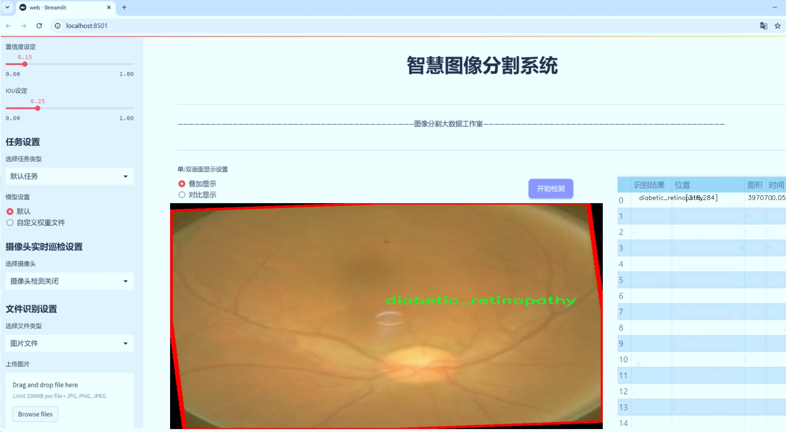
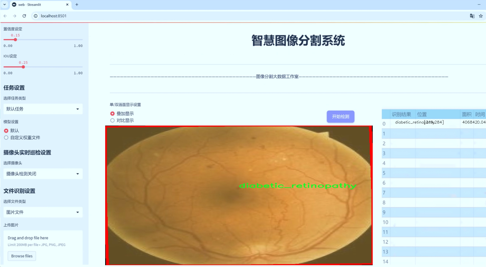
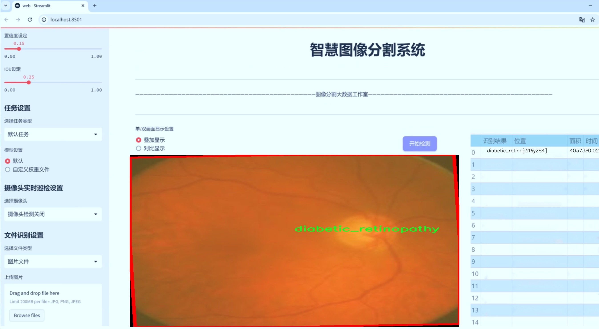
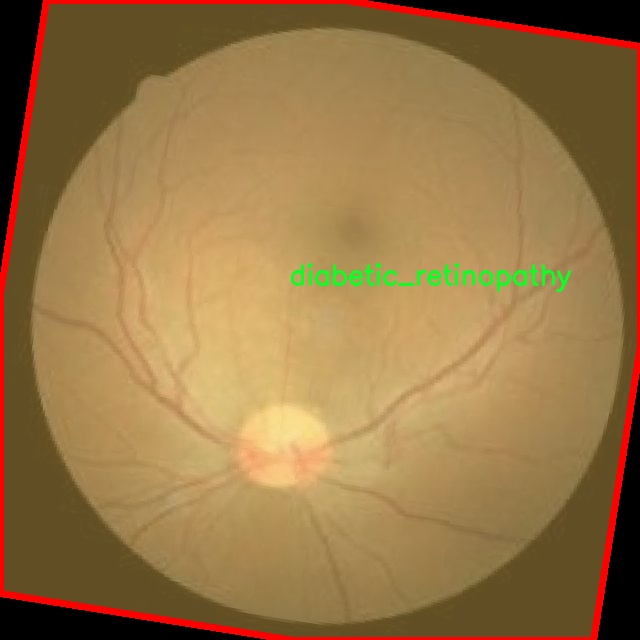
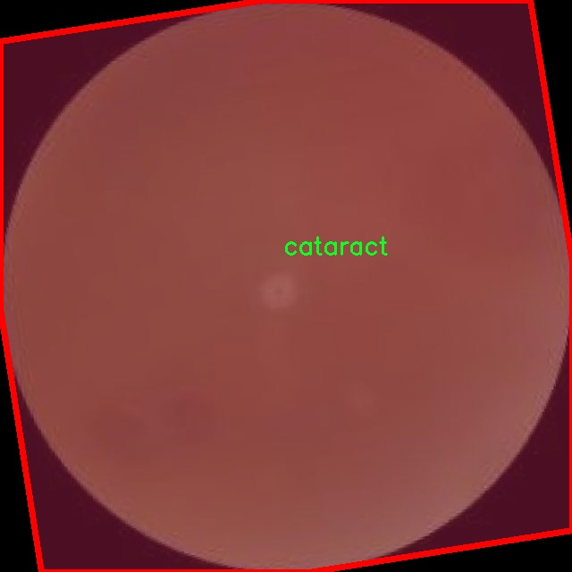
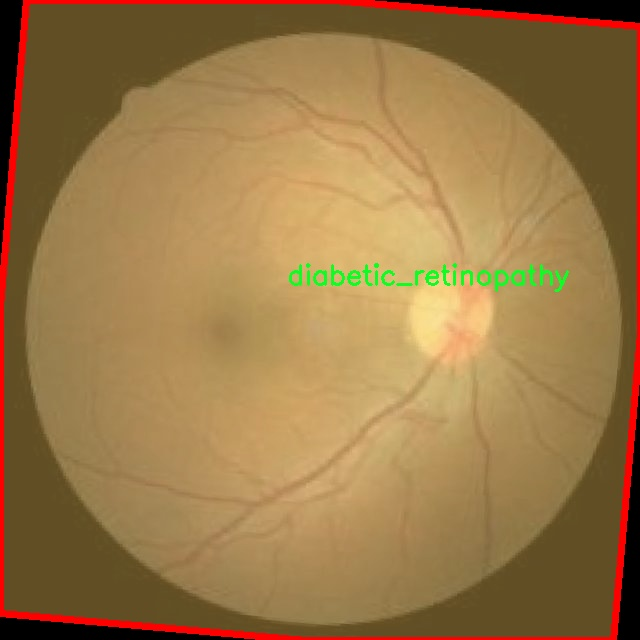
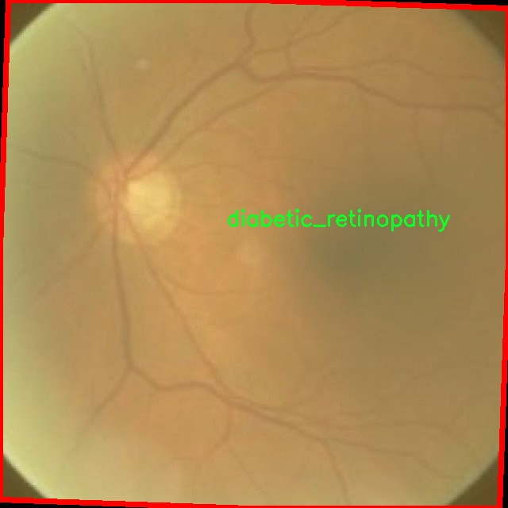
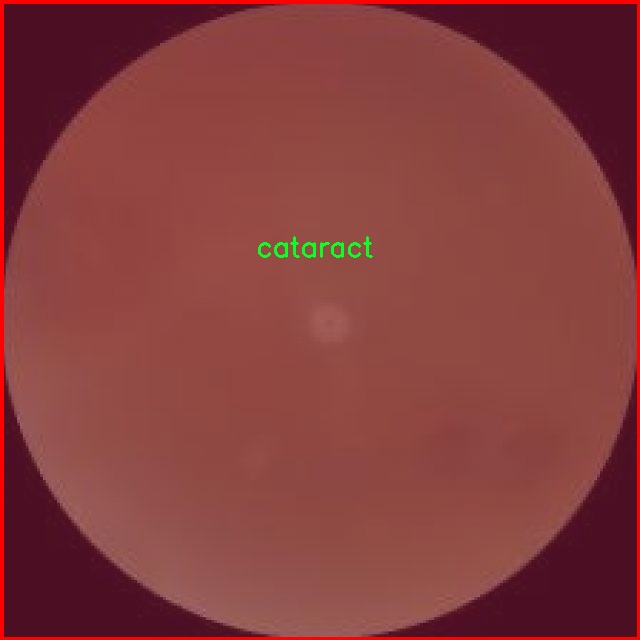

# 眼病图像分割系统： yolov8-seg-C2f-ODConv

### 1.研究背景与意义

[参考博客](https://gitee.com/YOLOv8_YOLOv11_Segmentation_Studio/projects)

[博客来源](https://kdocs.cn/l/cszuIiCKVNis)

研究背景与意义

随着全球人口老龄化的加剧，眼病的发病率逐年上升，成为了影响人们生活质量的重要健康问题。根据世界卫生组织的统计，眼病已成为导致视觉障碍和失明的主要原因之一，尤其是白内障、糖尿病视网膜病变和青光眼等疾病，给患者及其家庭带来了沉重的经济和心理负担。因此，及时、准确地诊断和治疗眼病显得尤为重要。近年来，随着计算机视觉和深度学习技术的快速发展，基于图像处理的眼病检测和诊断方法逐渐成为研究热点。

在这一背景下，眼病图像分割技术的研究显得尤为重要。图像分割是计算机视觉中的一项基本任务，其目标是将图像划分为若干个有意义的区域，以便于后续的分析和处理。在眼病的诊断中，图像分割可以帮助医生准确识别病变区域，从而提高诊断的准确性和效率。传统的图像分割方法往往依赖于手工特征提取，难以适应复杂的眼部图像特征。而基于深度学习的图像分割方法，尤其是YOLO（You Only Look Once）系列模型，因其高效性和准确性，逐渐成为眼病图像分割的主流选择。

本研究旨在基于改进的YOLOv8模型，构建一个高效的眼病图像分割系统。YOLOv8作为YOLO系列的最新版本，具备更强的特征提取能力和更快的推理速度，能够在实时性和准确性之间取得良好的平衡。通过对YOLOv8模型的改进，我们将其应用于眼病图像分割任务，以实现对不同类型眼病的准确识别和分割。具体而言，本研究将利用包含2600幅图像的眼病数据集，该数据集涵盖了四种类别：白内障、糖尿病视网膜病变、青光眼和正常眼部图像。这些类别的选择不仅反映了当前眼病的主要类型，也为模型的训练和评估提供了丰富的样本。

本研究的意义在于，通过构建基于改进YOLOv8的眼病图像分割系统，能够为眼科医生提供一种高效、准确的辅助诊断工具。这一系统不仅可以提高眼病的早期筛查和诊断效率，还能够为后续的治疗方案制定提供重要依据。此外，随着数据集的不断扩展和模型的进一步优化，该系统有望在未来的临床应用中发挥更大的作用，推动眼病诊疗的智能化和精准化进程。

综上所述，基于改进YOLOv8的眼病图像分割系统的研究，不仅具有重要的理论价值，也具有广泛的应用前景。通过深入探索深度学习在眼病图像处理中的应用，我们期望能够为眼科医学的发展贡献一份力量，同时为患者提供更为优质的医疗服务。

### 2.图片演示







注意：本项目提供完整的训练源码数据集和训练教程,由于此博客编辑较早,暂不提供权重文件（best.pt）,需要按照6.训练教程进行训练后实现上图效果。

### 3.视频演示

[3.1 视频演示](https://www.bilibili.com/video/BV1oSzGYvE2a/)

### 4.数据集信息

##### 4.1 数据集类别数＆类别名

nc: 4
names: ['cataract', 'diabetic_retinopathy', 'glaucoma', 'normal']


##### 4.2 数据集信息简介

数据集信息展示

在眼科医学领域，图像分割技术的应用日益广泛，尤其是在眼病的早期诊断和治疗中。为此，我们构建了一个名为“Eye-Disease”的数据集，旨在为改进YOLOv8-seg的眼病图像分割系统提供强有力的支持。该数据集包含四个主要类别，分别是白内障（cataract）、糖尿病视网膜病变（diabetic_retinopathy）、青光眼（glaucoma）和正常眼底（normal）。这些类别的选择基于眼科临床实践中常见的眼病，具有重要的临床意义和应用价值。

“Eye-Disease”数据集的构建过程经过精心设计，确保了数据的多样性和代表性。每个类别的图像均来源于真实的临床病例，涵盖了不同年龄、性别和种族的患者，确保了数据集的广泛适用性。通过与多家医院和眼科诊所的合作，我们收集了大量的眼底图像，并对其进行了严格的标注和分类。每幅图像都经过专业眼科医生的审核，确保标注的准确性和可靠性。

在数据集的设计中，我们特别注重图像的质量和分辨率，以便为YOLOv8-seg模型的训练提供高质量的输入。所有图像均为高分辨率，能够清晰地展示眼底的细微结构和病变特征。这对于模型的学习和特征提取至关重要，能够帮助其更好地识别和分割不同类型的眼病。

此外，数据集还考虑到了样本的不平衡问题。为了提高模型在不同类别上的表现，我们在数据集中对每个类别的样本数量进行了合理的配置，确保每个类别都有足够的样本进行训练。这种设计使得模型在训练过程中能够更好地学习到各个类别的特征，从而提高分割的准确性和鲁棒性。

在数据集的使用过程中，我们建议研究人员在进行模型训练时，采用数据增强技术，以进一步提升模型的泛化能力。通过旋转、缩放、翻转等操作，可以有效增加训练样本的多样性，从而使模型在面对未见过的图像时，依然能够保持良好的性能。

“Eye-Disease”数据集的发布，不仅为眼病图像分割研究提供了重要的基础数据，也为相关领域的研究者提供了一个良好的实验平台。通过对该数据集的深入研究和分析，研究人员可以探索更多的深度学习算法和技术，以期在眼病的早期诊断和治疗中取得更好的成果。

总之，“Eye-Disease”数据集的构建和应用，标志着眼科图像处理研究的一次重要进展。我们期待着该数据集能够推动眼病图像分割技术的发展，为眼科临床实践提供更为精准和高效的辅助工具。











### 5.项目依赖环境部署教程（零基础手把手教学）

[5.1 环境部署教程链接（零基础手把手教学）](https://www.bilibili.com/video/BV1jG4Ve4E9t/?vd_source=bc9aec86d164b67a7004b996143742dc)


[5.2 安装Python虚拟环境创建和依赖库安装视频教程链接（零基础手把手教学）](https://www.bilibili.com/video/BV1nA4VeYEze/?vd_source=bc9aec86d164b67a7004b996143742dc)

### 6.手把手YOLOV8-seg训练视频教程（零基础手把手教学）

[6.1 手把手YOLOV8-seg训练视频教程（零基础小白有手就能学会）](https://www.bilibili.com/video/BV1cA4VeYETe/?vd_source=bc9aec86d164b67a7004b996143742dc)


按照上面的训练视频教程链接加载项目提供的数据集，运行train.py即可开始训练



     Epoch   gpu_mem       box       obj       cls    labels  img_size
     1/200     0G   0.01576   0.01955  0.007536        22      1280: 100%|██████████| 849/849 [14:42<00:00,  1.04s/it]
               Class     Images     Labels          P          R     mAP@.5 mAP@.5:.95: 100%|██████████| 213/213 [01:14<00:00,  2.87it/s]
                 all       3395      17314      0.994      0.957      0.0957      0.0843

     Epoch   gpu_mem       box       obj       cls    labels  img_size
     2/200     0G   0.01578   0.01923  0.007006        22      1280: 100%|██████████| 849/849 [14:44<00:00,  1.04s/it]
               Class     Images     Labels          P          R     mAP@.5 mAP@.5:.95: 100%|██████████| 213/213 [01:12<00:00,  2.95it/s]
                 all       3395      17314      0.996      0.956      0.0957      0.0845

     Epoch   gpu_mem       box       obj       cls    labels  img_size
     3/200     0G   0.01561    0.0191  0.006895        27      1280: 100%|██████████| 849/849 [10:56<00:00,  1.29it/s]
               Class     Images     Labels          P          R     mAP@.5 mAP@.5:.95: 100%|███████   | 187/213 [00:52<00:00,  4.04it/s]
                 all       3395      17314      0.996      0.957      0.0957      0.0845


### 7.50+种全套YOLOV8-seg创新点加载调参实验视频教程（一键加载写好的改进模型的配置文件）

[7.1 50+种全套YOLOV8-seg创新点加载调参实验视频教程（一键加载写好的改进模型的配置文件）](https://www.bilibili.com/video/BV1Hw4VePEXv/?vd_source=bc9aec86d164b67a7004b996143742dc)

### YOLOV8-seg算法简介

原始YOLOv8-seg算法原理

YOLOv8-seg算法是由Ultralytics团队在YOLOv5的基础上发展而来的一个重要版本，于2023年1月正式发布。该算法不仅继承了YOLO系列模型的高效性和准确性，还在此基础上进行了多项创新和改进，尤其是在目标检测和分割任务中的应用。YOLOv8-seg的设计理念是将目标检测与图像分割相结合，使得模型能够在识别目标的同时，对目标的形状和边界进行精确的分割。这一特性使得YOLOv8-seg在处理复杂场景时表现得尤为出色，能够满足实际应用中对精度和实时性的双重需求。

在YOLOv8-seg的网络结构中，主要由三个部分组成：主干网络（backbone）、特征增强网络（neck）和检测头（head）。主干网络的设计依然基于CSP（Cross Stage Partial）结构，旨在通过深层次的特征提取来增强模型的表现。与之前的YOLO版本相比，YOLOv8-seg在主干网络中引入了C2f模块，这一模块的设计灵感来源于YOLOv7中的ELAN（Efficient Layer Aggregation Network），通过增加跳层连接来丰富梯度流信息，从而提高模型的学习能力。此外，C2f模块的引入也有效地减少了模型的计算复杂度，使得YOLOv8-seg在保持高精度的同时，能够实现更快的推理速度。

特征增强网络部分采用了PAN-FPN（Path Aggregation Network - Feature Pyramid Network）的结构，旨在通过多尺度特征融合来提升模型对不同尺度目标的检测能力。这一结构的优势在于能够有效地整合来自不同层次的特征信息，使得模型在处理复杂场景时能够更好地捕捉到目标的多样性和变化性。通过这种特征增强，YOLOv8-seg在面对各种目标时，能够保持较高的检测精度。

在检测头的设计上，YOLOv8-seg采用了解耦头的策略，将分类和回归任务分为两个独立的分支。这一设计的核心思想是让模型在处理分类和定位任务时，能够更加专注于各自的目标，避免了以往耦合头中可能出现的任务干扰问题。通过解耦，YOLOv8-seg在复杂场景下的定位精度和分类准确性得到了显著提升。此外，YOLOv8-seg还引入了无锚框（Anchor-free）结构，直接预测目标的中心位置，而不再依赖于预定义的锚框。这一创新使得模型在处理不同尺度和形状的目标时，能够更加灵活和高效，进一步提升了检测性能。

在训练过程中，YOLOv8-seg采用了多种数据增强技术，以提高模型的鲁棒性和泛化能力。其中，Mosaic数据增强技术的使用被认为能够有效提升模型对不同场景的适应性。然而，YOLOv8-seg在训练的最后10个epoch中停止使用Mosaic增强，以避免对数据真实分布的破坏，从而确保模型学习到的特征更加可靠。

在实际应用中，YOLOv8-seg展现出了优越的性能。根据官方在COCO数据集上的测试结果，YOLOv8-seg在同尺寸模型中实现了更高的mAP（mean Average Precision），同时在推理速度上也有显著提升。这一系列的改进使得YOLOv8-seg在实时目标检测和分割任务中表现得尤为突出，尤其适合于需要快速响应的应用场景，如智能监控、自动驾驶和机器人视觉等。

总的来说，YOLOv8-seg算法的提出不仅是YOLO系列的又一次重要迭代，更是目标检测与分割领域的一次创新尝试。通过对网络结构的优化、任务解耦的设计以及无锚框的引入，YOLOv8-seg在准确性和速度上都达到了新的高度。这些特性使得YOLOv8-seg在各种复杂应用场景中具备了广泛的适用性和研究价值，成为了目标检测与分割领域的重要工具。随着对YOLOv8-seg算法的深入研究，未来有望在更多实际应用中发挥其独特的优势，推动相关技术的发展与进步。


### 9.系统功能展示（检测对象为举例，实际内容以本项目数据集为准）

图9.1.系统支持检测结果表格显示

  图9.2.系统支持置信度和IOU阈值手动调节

  图9.3.系统支持自定义加载权重文件best.pt(需要你通过步骤5中训练获得)

  图9.4.系统支持摄像头实时识别

  图9.5.系统支持图片识别

  图9.6.系统支持视频识别

  图9.7.系统支持识别结果文件自动保存

  图9.8.系统支持Excel导出检测结果数据


### 10.50+种全套YOLOV8-seg创新点原理讲解（非科班也可以轻松写刊发刊，V11版本正在科研待更新）

#### 10.1 由于篇幅限制，每个创新点的具体原理讲解就不一一展开，具体见下列网址中的创新点对应子项目的技术原理博客网址【Blog】：


[10.1 50+种全套YOLOV8-seg创新点原理讲解链接](https://gitee.com/qunmasj/good)

#### 10.2 部分改进模块原理讲解(完整的改进原理见上图和技术博客链接)【如果此小节的图加载失败可以通过CSDN或者Github搜索该博客的标题访问原始博客，原始博客图片显示正常】
### YOLOv8简介
#### Backbone


借鉴了其他算法的这些设计思想

借鉴了VGG的思想，使用了较多的3×3卷积，在每一次池化操作后，将通道数翻倍；

借鉴了network in network的思想，使用全局平均池化（global average pooling）做预测，并把1×1的卷积核置于3×3的卷积核之间，用来压缩特征；（我没找到这一步体现在哪里）

使用了批归一化层稳定模型训练，加速收敛，并且起到正则化作用。

    以上三点为Darknet19借鉴其他模型的点。Darknet53当然是在继承了Darknet19的这些优点的基础上再新增了下面这些优点的。因此列在了这里

借鉴了ResNet的思想，在网络中大量使用了残差连接，因此网络结构可以设计的很深，并且缓解了训练中梯度消失的问题，使得模型更容易收敛。

使用步长为2的卷积层代替池化层实现降采样。（这一点在经典的Darknet-53上是很明显的，output的长和宽从256降到128，再降低到64，一路降低到8，应该是通过步长为2的卷积层实现的；在YOLOv8的卷积层中也有体现，比如图中我标出的这些位置）

#### 特征融合

模型架构图如下

  Darknet-53的特点可以这样概括：（Conv卷积模块+Residual Block残差块）串行叠加4次

  Conv卷积层+Residual Block残差网络就被称为一个stage


上面红色指出的那个，原始的Darknet-53里面有一层 卷积，在YOLOv8里面，把一层卷积移除了

为什么移除呢？

        原始Darknet-53模型中间加的这个卷积层做了什么？滤波器（卷积核）的个数从 上一个卷积层的512个，先增加到1024个卷积核，然后下一层卷积的卷积核的个数又降低到512个

        移除掉这一层以后，少了1024个卷积核，就可以少做1024次卷积运算，同时也少了1024个3×3的卷积核的参数，也就是少了9×1024个参数需要拟合。这样可以大大减少了模型的参数，（相当于做了轻量化吧）

        移除掉这个卷积层，可能是因为作者发现移除掉这个卷积层以后，模型的score有所提升，所以才移除掉的。为什么移除掉以后，分数有所提高呢？可能是因为多了这些参数就容易，参数过多导致模型在训练集删过拟合，但是在测试集上表现很差，最终模型的分数比较低。你移除掉这个卷积层以后，参数减少了，过拟合现象不那么严重了，泛化能力增强了。当然这个是，拿着你做实验的结论，反过来再找补，再去强行解释这种现象的合理性。

过拟合


通过MMdetection官方绘制册这个图我们可以看到，进来的这张图片经过一个“Feature Pyramid Network(简称FPN)”，然后最后的P3、P4、P5传递给下一层的Neck和Head去做识别任务。 PAN（Path Aggregation Network）


“FPN是自顶向下，将高层的强语义特征传递下来。PAN就是在FPN的后面添加一个自底向上的金字塔，对FPN补充，将低层的强定位特征传递上去，

FPN是自顶（小尺寸，卷积次数多得到的结果，语义信息丰富）向下（大尺寸，卷积次数少得到的结果），将高层的强语义特征传递下来，对整个金字塔进行增强，不过只增强了语义信息，对定位信息没有传递。PAN就是针对这一点，在FPN的后面添加一个自底（卷积次数少，大尺寸）向上（卷积次数多，小尺寸，语义信息丰富）的金字塔，对FPN补充，将低层的强定位特征传递上去，又被称之为“双塔战术”。

FPN层自顶向下传达强语义特征，而特征金字塔则自底向上传达强定位特征，两两联手，从不同的主干层对不同的检测层进行参数聚合,这样的操作确实很皮。
#### 自底向上增强

而 PAN（Path Aggregation Network）是对 FPN 的一种改进，它的设计理念是在 FPN 后面添加一个自底向上的金字塔。PAN 引入了路径聚合的方式，通过将浅层特征图（低分辨率但语义信息较弱）和深层特征图（高分辨率但语义信息丰富）进行聚合，并沿着特定的路径传递特征信息，将低层的强定位特征传递上去。这样的操作能够进一步增强多尺度特征的表达能力，使得 PAN 在目标检测任务中表现更加优秀。


### 可重参化EfficientRepBiPAN优化Neck
#### Repvgg-style
Repvgg-style的卷积层包含
卷积+ReLU结构，该结构能够有效地利用硬件资源。

在训练时，Repvgg-style的卷积层包含
卷积、
卷积、identity。（下图左图）


在推理时，通过重参数化（re-parameterization），上述的多分支结构可以转换为单分支的
卷积。（下图右图）


基于上述思想，作者设计了对GPU硬件友好的EfficientRep Backbone和Rep-PAN Neck，将它们用于YOLOv6中。

EfficientRep Backbone的结构图：


Rep-PAN Neck结构图：


#### Multi-path
只使用repvgg-style不能达到很好的精度-速度平衡，对于大模型，作者探索了多路径的网络结构。

参考该博客提出了Bep unit，其结构如下图所示：


CSP（Cross Stage Partial）-style计算量小，且有丰富的梯度融合信息，广泛应用于YOLO系列中，比如YOLOv5、PPYOLOE。

作者将Bep unit与CSP-style结合，设计了一种新的网络结构BepC3，如下图所示：


基于BepC3模块，作者设计了新的CSPBep Backbone和CSPRepPAN Neck，以达到很好的精度-速度平衡。

其他YOLO系列在使用CSP-stype结构时，partial ratio设置为1/2。为了达到更好的性能，在YOLOv6m中partial ratio的值为2/3，在YOLOv6l中partial ratio的值为1/2。

对于YOLOv6m，单纯使用Rep-style结构和使用BepC3结构的对比如下图所示：

#### BIFPN
BiFPN 全称 Bidirectional Feature Pyramid Network 加权双向（自顶向下 + 自低向上）特征金字塔网络。

相比较于PANet，BiFPN在设计上的改变：

总结下图：
图d 蓝色部分为自顶向下的通路，传递的是高层特征的语义信息；红色部分是自底向上的通路，传递的是低层特征的位置信息；紫色部分是上述第二点提到的同一层在输入节点和输入节点间新加的一条边。


我们删除那些只有一条输入边的节点。这么做的思路很简单：如果一个节点只有一条输入边而没有特征融合，那么它对旨在融合不同特征的特征网络的贡献就会很小。删除它对我们的网络影响不大，同时简化了双向网络；如上图d 的 P7右边第一个节点

如果原始输入节点和输出节点处于同一层，我们会在原始输入节点和输出节点之间添加一条额外的边。思路：以在不增加太多成本的情况下融合更多的特性；

与只有一个自顶向下和一个自底向上路径的PANet不同，我们处理每个双向路径(自顶向下和自底而上)路径作为一个特征网络层，并重复同一层多次，以实现更高层次的特征融合。如下图EfficientNet 的网络结构所示，我们对BiFPN是重复使用多次的。而这个使用次数也不是我们认为设定的，而是作为参数一起加入网络的设计当中，使用NAS技术算出来的。


Weighted Feature Fusion 带权特征融合：学习不同输入特征的重要性，对不同输入特征有区分的融合。
设计思路：传统的特征融合往往只是简单的 feature map 叠加/相加 (sum them up)，比如使用concat或者shortcut连接，而不对同时加进来的 feature map 进行区分。然而，不同的输入 feature map 具有不同的分辨率，它们对融合输入 feature map 的贡献也是不同的，因此简单的对他们进行相加或叠加处理并不是最佳的操作。所以这里我们提出了一种简单而高效的加权特融合的机制。
常见的带权特征融合有三种方法，分别是：


​
  这种方法比较简单，直接加一个可学习的权重。但是由于这个权重不受限制，所有可能引起训练的不稳定，所有并不推荐。
Softmax-based fusion: O = ∑ i e w i ∗ I i ϵ + ∑ j e w j O = \sum_{i} \frac{e^{w_i} * I_i}{ \epsilon+\sum_{j}e^{w_j}}O=∑ 

 

​
  使用这种方法可以将范围放缩到 [ 0 , 1 ] [0, 1][0,1] 之间，训练稳定，但是训练很慢，所有也不推荐。
Fast normalized fusion: O = ∑ i w i ∗ I i ϵ + ∑ j w j O = \sum_{i} \frac{w_i * I_i}{ \epsilon+\sum_{j}w_j}O=∑ 


### 11.项目核心源码讲解（再也不用担心看不懂代码逻辑）

#### 11.1 ultralytics\hub\session.py

以下是经过精简和注释的核心代码部分，保留了主要功能并进行了详细的中文注释：

```python
# Ultralytics YOLO 🚀, AGPL-3.0 license

import signal
import sys
from pathlib import Path
from time import sleep
import requests
from ultralytics.hub.utils import HUB_API_ROOT, HUB_WEB_ROOT, smart_request
from ultralytics.utils import LOGGER, __version__, checks, is_colab
from ultralytics.utils.errors import HUBModelError

# 根据运行环境设置代理名称
AGENT_NAME = f'python-{__version__}-colab' if is_colab() else f'python-{__version__}-local'

class HUBTrainingSession:
    """
    HUB训练会话类，用于管理Ultralytics HUB YOLO模型的初始化、心跳和检查点上传。
    """

    def __init__(self, url):
        """
        初始化HUBTrainingSession，使用提供的模型标识符。

        Args:
            url (str): 用于初始化HUB训练会话的模型标识符，可以是URL字符串或特定格式的模型键。
        """
        from ultralytics.hub.auth import Auth

        # 解析输入的模型URL
        if url.startswith(f'{HUB_WEB_ROOT}/models/'):
            url = url.split(f'{HUB_WEB_ROOT}/models/')[-1]
        if [len(x) for x in url.split('_')] == [42, 20]:
            key, model_id = url.split('_')
        elif len(url) == 20:
            key, model_id = '', url
        else:
            raise HUBModelError(f"model='{url}' not found. Check format is correct.")

        # 授权
        auth = Auth(key)
        self.model_id = model_id
        self.model_url = f'{HUB_WEB_ROOT}/models/{model_id}'
        self.api_url = f'{HUB_API_ROOT}/v1/models/{model_id}'
        self.auth_header = auth.get_auth_header()
        self.metrics_queue = {}  # 用于存储模型指标的队列
        self.model = self._get_model()  # 获取模型数据
        self.alive = True
        self._start_heartbeat()  # 启动心跳机制
        self._register_signal_handlers()  # 注册信号处理器
        LOGGER.info(f'查看模型: {self.model_url} 🚀')

    def _register_signal_handlers(self):
        """注册信号处理器以优雅地处理终止信号。"""
        signal.signal(signal.SIGTERM, self._handle_signal)
        signal.signal(signal.SIGINT, self._handle_signal)

    def _handle_signal(self, signum, frame):
        """处理终止信号，停止心跳并退出程序。"""
        if self.alive:
            LOGGER.info('收到终止信号! ❌')
            self._stop_heartbeat()
            sys.exit(signum)

    def _stop_heartbeat(self):
        """终止心跳循环。"""
        self.alive = False

    def upload_metrics(self):
        """上传模型指标到Ultralytics HUB。"""
        payload = {'metrics': self.metrics_queue.copy(), 'type': 'metrics'}
        smart_request('post', self.api_url, json=payload, headers=self.auth_header)

    def _get_model(self):
        """从Ultralytics HUB获取并返回模型数据。"""
        api_url = f'{HUB_API_ROOT}/v1/models/{self.model_id}'
        try:
            response = smart_request('get', api_url, headers=self.auth_header)
            data = response.json().get('data', None)

            if data.get('status') == 'trained':
                raise ValueError('模型已训练并上传。')

            if not data.get('data'):
                raise ValueError('数据集可能仍在处理，请稍后再试。')

            self.model_id = data['id']
            return data
        except requests.exceptions.ConnectionError:
            raise ConnectionRefusedError('ERROR: HUB服务器未在线，请稍后再试。')

    def upload_model(self, epoch, weights, is_best=False, map=0.0, final=False):
        """
        上传模型检查点到Ultralytics HUB。

        Args:
            epoch (int): 当前训练的轮次。
            weights (str): 模型权重文件的路径。
            is_best (bool): 当前模型是否为最佳模型。
            map (float): 模型的平均精度。
            final (bool): 模型是否为最终模型。
        """
        if Path(weights).is_file():
            with open(weights, 'rb') as f:
                file = f.read()
        else:
            LOGGER.warning(f'模型上传问题，缺少模型 {weights}.')
            file = None

        url = f'{self.api_url}/upload'
        data = {'epoch': epoch}
        if final:
            data.update({'type': 'final', 'map': map})
            smart_request('post', url, data=data, files={'final.pt': file}, headers=self.auth_header)
        else:
            data.update({'type': 'epoch', 'isBest': is_best})
            smart_request('post', url, data=data, files={'last.pt': file}, headers=self.auth_header)

    def _start_heartbeat(self):
        """开始一个线程心跳循环，定期报告代理状态到Ultralytics HUB。"""
        while self.alive:
            r = smart_request('post', f'{HUB_API_ROOT}/v1/agent/heartbeat/models/{self.model_id}',
                              json={'agent': AGENT_NAME}, headers=self.auth_header)
            sleep(300)  # 每300秒发送一次心跳
```

### 代码说明：
1. **HUBTrainingSession类**：用于管理Ultralytics HUB YOLO模型的训练会话，包括模型的初始化、心跳机制和指标上传。
2. **初始化方法**：解析模型标识符，进行授权，获取模型数据，并启动心跳机制。
3. **信号处理**：注册处理终止信号的方法，以便在接收到终止信号时优雅地停止心跳并退出程序。
4. **上传指标**：将训练过程中收集的指标上传到Ultralytics HUB。
5. **获取模型**：从Ultralytics HUB获取模型数据，并处理可能的错误。
6. **上传模型**：将训练过程中的模型检查点上传到Ultralytics HUB。
7. **心跳机制**：定期向Ultralytics HUB报告代理的状态，确保连接的活跃性。

这个文件是Ultralytics YOLO模型的一个训练会话管理类，主要用于处理模型的初始化、心跳信号和检查点上传等功能。首先，文件导入了一些必要的库，包括信号处理、系统操作、路径处理、时间延迟和HTTP请求等。

在类`HUBTrainingSession`的构造函数中，首先解析传入的模型标识符`url`，该标识符可以是一个URL字符串或特定格式的模型键。如果格式不正确，则会抛出自定义的`HUBModelError`异常。接着，使用`Auth`类进行身份验证，并初始化多个属性，例如代理ID、模型ID、模型URL、API URL、身份验证头、速率限制、计时器、模型数据队列等。然后，通过调用`_get_model`方法从Ultralytics HUB获取模型数据，并启动心跳信号循环。

该类还定义了信号处理器，能够优雅地处理终止信号（如SIGTERM和SIGINT），确保在Colab环境中终止后不会继续发送心跳信号。`_stop_heartbeat`方法用于停止心跳循环，而`upload_metrics`方法则用于将模型的指标上传到Ultralytics HUB。

`_get_model`方法用于从Ultralytics HUB获取模型数据，并根据模型的状态（如新模型、正在训练的模型等）设置训练参数。如果连接失败，则会抛出连接错误的异常。

此外，`upload_model`方法用于将模型的检查点上传到Ultralytics HUB，支持上传当前训练的权重文件，并指明当前的训练轮次、是否为最佳模型等信息。最后，`_start_heartbeat`方法启动一个线程，定期向Ultralytics HUB发送心跳信号，以报告代理的状态。

整体来看，这个文件实现了Ultralytics YOLO模型在训练过程中的会话管理功能，确保与Ultralytics HUB的通信和数据上传的顺畅。

#### 11.2 ultralytics\nn\backbone\CSwomTramsformer.py

以下是经过简化并添加详细中文注释的核心代码部分：

```python
import torch
import torch.nn as nn
import numpy as np

class Mlp(nn.Module):
    """多层感知机（MLP）模块"""
    def __init__(self, in_features, hidden_features=None, out_features=None, act_layer=nn.GELU, drop=0.):
        super().__init__()
        out_features = out_features or in_features  # 输出特征数
        hidden_features = hidden_features or in_features  # 隐藏层特征数
        self.fc1 = nn.Linear(in_features, hidden_features)  # 第一层线性变换
        self.act = act_layer()  # 激活函数
        self.fc2 = nn.Linear(hidden_features, out_features)  # 第二层线性变换
        self.drop = nn.Dropout(drop)  # Dropout层

    def forward(self, x):
        """前向传播"""
        x = self.fc1(x)  # 线性变换
        x = self.act(x)  # 激活
        x = self.drop(x)  # Dropout
        x = self.fc2(x)  # 线性变换
        x = self.drop(x)  # Dropout
        return x

class CSWinBlock(nn.Module):
    """CSWin Transformer的基本块"""
    def __init__(self, dim, num_heads, mlp_ratio=4., drop=0., attn_drop=0., norm_layer=nn.LayerNorm):
        super().__init__()
        self.dim = dim  # 输入特征维度
        self.num_heads = num_heads  # 注意力头数
        self.mlp_ratio = mlp_ratio  # MLP的隐藏层比率
        self.norm1 = norm_layer(dim)  # 归一化层
        self.qkv = nn.Linear(dim, dim * 3)  # 线性变换生成Q、K、V

        # 注意力层
        self.attn = LePEAttention(dim, num_heads=num_heads, attn_drop=attn_drop)

        # MLP层
        mlp_hidden_dim = int(dim * mlp_ratio)  # 隐藏层维度
        self.mlp = Mlp(in_features=dim, hidden_features=mlp_hidden_dim, out_features=dim, drop=drop)
        self.norm2 = norm_layer(dim)  # 第二个归一化层

    def forward(self, x):
        """前向传播"""
        img = self.norm1(x)  # 归一化
        qkv = self.qkv(img).reshape(x.shape[0], -1, 3, self.dim).permute(2, 0, 1, 3)  # 生成Q、K、V
        
        attn_output = self.attn(qkv)  # 注意力计算
        x = x + attn_output  # 残差连接
        x = x + self.mlp(self.norm2(x))  # MLP层与残差连接
        return x

class CSWinTransformer(nn.Module):
    """CSWin Transformer模型"""
    def __init__(self, img_size=640, in_chans=3, num_classes=1000, embed_dim=96, depth=[2,2,6,2], num_heads=12):
        super().__init__()
        self.num_classes = num_classes
        self.embed_dim = embed_dim  # 嵌入维度

        # 输入层
        self.stage1_conv_embed = nn.Sequential(
            nn.Conv2d(in_chans, embed_dim, kernel_size=7, stride=4, padding=2),  # 卷积层
            nn.LayerNorm(embed_dim)  # 归一化层
        )

        # Transformer块
        self.stage1 = nn.ModuleList([
            CSWinBlock(dim=embed_dim, num_heads=num_heads) for _ in range(depth[0])
        ])

        # 其他阶段的块和合并层省略...

    def forward(self, x):
        """前向传播"""
        x = self.stage1_conv_embed(x)  # 输入层处理
        for blk in self.stage1:
            x = blk(x)  # 逐层通过Transformer块
        return x

# 示例用法
if __name__ == '__main__':
    inputs = torch.randn((1, 3, 640, 640))  # 随机输入
    model = CSWinTransformer()  # 创建模型
    res = model(inputs)  # 前向传播
    print(res.size())  # 输出结果尺寸
```

### 代码说明：
1. **Mlp类**：实现了一个简单的多层感知机，包括两个线性层和一个激活函数。使用Dropout来防止过拟合。
2. **CSWinBlock类**：实现了CSWin Transformer的基本构建块，包含归一化、注意力机制和MLP层。通过残差连接将输入与输出相加。
3. **CSWinTransformer类**：构建整个Transformer模型，包含输入层和多个Transformer块。通过逐层调用来处理输入数据。
4. **主函数**：创建一个随机输入并通过模型进行前向传播，输出结果的尺寸。

这个程序文件实现了一个名为CSWin Transformer的深度学习模型，主要用于计算机视觉任务。文件中包含了多个类和函数，构成了模型的整体架构。以下是对代码的详细说明。

首先，文件引入了必要的库，包括PyTorch及其相关模块，Timm库用于模型的构建和预训练权重的加载，以及一些用于数据处理的工具。接着，定义了几个模型的变体，包括CSWin_tiny、CSWin_small、CSWin_base和CSWin_large。

在模型的构建中，Mlp类实现了一个多层感知机（MLP），包含两个线性层和一个激活函数（默认为GELU），并且在每个线性层后面都添加了Dropout以防止过拟合。

LePEAttention类实现了一个自定义的注意力机制，使用了分块的方式来处理输入数据。它将输入的特征图转换为窗口形式，并通过计算注意力权重来对特征进行加权。这个类的核心在于im2cswin和get_lepe方法，前者用于将输入转换为窗口，后者则用于计算局部增强的注意力。

CSWinBlock类则是CSWin Transformer的基本构建块，包含了一个注意力层和一个MLP层。它的forward方法实现了前向传播的逻辑，首先对输入进行归一化，然后计算Q、K、V矩阵，接着通过注意力机制处理这些矩阵，并最终将结果与输入相加。

在模型的整体结构中，CSWinTransformer类定义了整个网络的架构，包括输入层、多个CSWinBlock的堆叠以及合并块（Merge_Block），用于在不同阶段之间进行特征融合。每个阶段的深度和头数可以通过参数进行配置。

文件中还定义了一些辅助函数，例如img2windows和windows2img，用于在图像和窗口之间进行转换。_conv_filter和update_weight函数则用于处理模型权重的加载和更新。

最后，CSWin_tiny、CSWin_small、CSWin_base和CSWin_large函数分别构建了不同规模的CSWin Transformer模型，并提供了加载预训练权重的选项。在主程序中，创建了不同规模的模型实例，并对随机输入进行了前向传播，输出了每个模型的特征图尺寸。

整体来看，这个文件实现了一个复杂的视觉Transformer模型，结合了多种先进的技术，如局部增强注意力机制和分块处理，适用于图像分类等任务。

#### 11.3 ultralytics\models\sam\modules\__init__.py

以下是代码的核心部分，并附上详细的中文注释：

```python
# Ultralytics YOLO 🚀, AGPL-3.0 license

# YOLO（You Only Look Once）是一种实时目标检测模型，Ultralytics是其一个实现版本。
# 该代码的许可证为AGPL-3.0，意味着该代码可以自由使用和修改，但任何基于该代码的衍生作品也必须开源。

# 下面是YOLO模型的核心部分（假设有一些核心功能代码）：

class YOLO:
    def __init__(self, model_path):
        """
        初始化YOLO模型。
        
        参数:
        model_path (str): 模型文件的路径，用于加载预训练的YOLO模型。
        """
        self.model = self.load_model(model_path)  # 加载模型

    def load_model(self, model_path):
        """
        加载YOLO模型。
        
        参数:
        model_path (str): 模型文件的路径。
        
        返回:
        model: 加载的YOLO模型。
        """
        # 这里通常会使用深度学习框架（如PyTorch）加载模型
        model = ...  # 伪代码，实际加载模型的实现
        return model

    def detect(self, image):
        """
        在给定的图像上进行目标检测。
        
        参数:
        image: 输入的图像数据，可以是图像文件或图像数组。
        
        返回:
        detections: 检测到的目标信息，包括类别和位置。
        """
        detections = self.model.predict(image)  # 使用模型进行预测
        return detections  # 返回检测结果
```

### 注释说明：
1. **类定义**：`YOLO`类是实现YOLO目标检测的核心部分。
2. **初始化方法**：`__init__`方法用于初始化YOLO模型，接收模型路径并加载模型。
3. **加载模型**：`load_model`方法负责从指定路径加载YOLO模型，通常使用深度学习框架的加载功能。
4. **目标检测**：`detect`方法接受一张图像，使用加载的模型进行目标检测，并返回检测结果。

这些部分是YOLO目标检测的核心功能，能够完成模型的加载和图像的目标检测。

这个文件是Ultralytics YOLO项目的一部分，具体位于`ultralytics/models/sam/modules/__init__.py`。从文件名和路径可以看出，它属于一个模块的初始化文件。在Python中，`__init__.py`文件的主要作用是将包含它的目录标识为一个包，使得该目录可以被导入为一个模块。

文件开头的注释`# Ultralytics YOLO 🚀, AGPL-3.0 license`表明这个项目是Ultralytics开发的YOLO（You Only Look Once）系列模型的一部分，YOLO是一种广泛使用的目标检测算法。注释中提到的AGPL-3.0许可证则说明了该项目的开源性质，允许用户自由使用、修改和分发代码，但要求在分发时保持相同的许可证。

虽然该文件的具体代码内容没有提供，但通常情况下，`__init__.py`文件可能会包含一些初始化代码，导入其他模块或类，或者定义包的公共接口。通过在这个文件中进行必要的导入，用户可以方便地访问整个模块的功能，而不需要逐个导入子模块。

总的来说，这个文件是Ultralytics YOLO项目的一个重要组成部分，确保了模块的正确组织和可用性，同时遵循开源许可证的规定。

#### 11.4 ultralytics\cfg\__init__.py

以下是代码中最核心的部分，并附上详细的中文注释：

```python
def cfg2dict(cfg):
    """
    将配置对象转换为字典，无论它是文件路径、字符串还是SimpleNamespace对象。

    参数:
        cfg (str | Path | dict | SimpleNamespace): 要转换为字典的配置对象。

    返回:
        cfg (dict): 以字典格式表示的配置对象。
    """
    if isinstance(cfg, (str, Path)):
        cfg = yaml_load(cfg)  # 从文件加载字典
    elif isinstance(cfg, SimpleNamespace):
        cfg = vars(cfg)  # 转换为字典
    return cfg


def get_cfg(cfg: Union[str, Path, Dict, SimpleNamespace] = DEFAULT_CFG_DICT, overrides: Dict = None):
    """
    从文件或字典加载并合并配置数据。

    参数:
        cfg (str | Path | Dict | SimpleNamespace): 配置数据。
        overrides (str | Dict | optional): 以文件名或字典形式的覆盖项。默认为None。

    返回:
        (SimpleNamespace): 训练参数命名空间。
    """
    cfg = cfg2dict(cfg)

    # 合并覆盖项
    if overrides:
        overrides = cfg2dict(overrides)
        if 'save_dir' not in cfg:
            overrides.pop('save_dir', None)  # 忽略特殊覆盖键
        check_dict_alignment(cfg, overrides)
        cfg = {**cfg, **overrides}  # 合并cfg和覆盖字典（优先使用覆盖项）

    # 特殊处理数字项目/名称
    for k in 'project', 'name':
        if k in cfg and isinstance(cfg[k], (int, float)):
            cfg[k] = str(cfg[k])
    if cfg.get('name') == 'model':  # 将模型赋值给'name'参数
        cfg['name'] = cfg.get('model', '').split('.')[0]
        LOGGER.warning(f"WARNING ⚠️ 'name=model' 自动更新为 'name={cfg['name']}'.")

    # 类型和值检查
    for k, v in cfg.items():
        if v is not None:  # None值可能来自可选参数
            if k in CFG_FLOAT_KEYS and not isinstance(v, (int, float)):
                raise TypeError(f"'{k}={v}' 的类型 {type(v).__name__} 无效. "
                                f"有效的 '{k}' 类型是 int（例如 '{k}=0'）或 float（例如 '{k}=0.5'）")
            elif k in CFG_FRACTION_KEYS:
                if not isinstance(v, (int, float)):
                    raise TypeError(f"'{k}={v}' 的类型 {type(v).__name__} 无效. "
                                    f"有效的 '{k}' 类型是 int（例如 '{k}=0'）或 float（例如 '{k}=0.5'）")
                if not (0.0 <= v <= 1.0):
                    raise ValueError(f"'{k}={v}' 的值无效. "
                                     f"有效的 '{k}' 值在 0.0 和 1.0 之间。")
            elif k in CFG_INT_KEYS and not isinstance(v, int):
                raise TypeError(f"'{k}={v}' 的类型 {type(v).__name__} 无效. "
                                f"'{k}' 必须是 int（例如 '{k}=8'）")
            elif k in CFG_BOOL_KEYS and not isinstance(v, bool):
                raise TypeError(f"'{k}={v}' 的类型 {type(v).__name__} 无效. "
                                f"'{k}' 必须是 bool（例如 '{k}=True' 或 '{k}=False'）")

    # 返回实例
    return IterableSimpleNamespace(**cfg)


def entrypoint(debug=''):
    """
    该函数是ultralytics包的入口点，负责解析传递给包的命令行参数。

    该函数允许：
    - 以字符串列表的形式传递必需的YOLO参数
    - 指定要执行的任务，'detect'、'segment'或'classify'
    - 指定模式，'train'、'val'、'test'或'predict'
    - 运行特殊模式，如'checks'
    - 向包的配置传递覆盖项

    它使用包的默认配置并使用传递的覆盖项初始化它。
    然后调用具有组合配置的CLI函数。
    """
    args = (debug.split(' ') if debug else sys.argv)[1:]
    if not args:  # 没有传递参数
        LOGGER.info(CLI_HELP_MSG)
        return

    # 处理特殊命令
    special = {
        'help': lambda: LOGGER.info(CLI_HELP_MSG),
        'checks': checks.collect_system_info,
        'version': lambda: LOGGER.info(__version__),
        'settings': lambda: handle_yolo_settings(args[1:]),
        'cfg': lambda: yaml_print(DEFAULT_CFG_PATH),
        'hub': lambda: handle_yolo_hub(args[1:]),
        'login': lambda: handle_yolo_hub(args),
        'copy-cfg': copy_default_cfg}

    # 合并参数并处理覆盖项
    overrides = {}
    for a in merge_equals_args(args):  # 合并'='周围的空格
        if '=' in a:
            try:
                k, v = parse_key_value_pair(a)
                overrides[k] = v
            except (NameError, SyntaxError, ValueError, AssertionError) as e:
                check_dict_alignment(full_args_dict, {a: ''}, e)

    # 检查键
    check_dict_alignment(full_args_dict, overrides)

    # 运行命令
    getattr(model, mode)(**overrides)  # 使用模型的默认参数运行命令

    # 显示帮助信息
    LOGGER.info(f'💡 了解更多信息请访问 https://docs.ultralytics.com/modes/{mode}')


if __name__ == '__main__':
    # 示例: entrypoint(debug='yolo predict model=yolov8n.pt')
    entrypoint(debug='')
```

### 代码核心部分解释：
1. **cfg2dict**: 将不同类型的配置对象（如字符串、路径或命名空间）转换为字典格式，以便后续处理。
2. **get_cfg**: 加载并合并配置，检查参数类型和有效性，确保配置的正确性。
3. **entrypoint**: 作为程序的入口，解析命令行参数，处理特殊命令，并根据用户输入执行相应的YOLO操作。

这个程序文件是Ultralytics YOLO（You Only Look Once）模型的配置和命令行接口（CLI）实现部分。文件的主要功能是处理用户输入的命令行参数，加载和合并配置，进行参数验证，并根据用户的请求执行相应的任务，如训练、验证、预测等。

首先，文件导入了一些必要的库和模块，包括路径处理、类型检查和Ultralytics库中的工具函数。接着，定义了一些有效的任务和模式，例如任务包括检测、分割、分类和姿态估计，而模式则包括训练、验证、预测、导出等。

文件中定义了一些映射关系，例如任务与数据集、模型和评估指标之间的对应关系。这些映射关系便于在执行特定任务时自动选择合适的配置。

接下来，文件提供了一个帮助信息字符串，详细说明了如何使用命令行接口，包括可用的任务、模式和参数示例。这对于用户理解如何使用该工具非常重要。

在配置处理方面，文件提供了多个函数来处理配置的加载和验证。例如，`cfg2dict`函数可以将配置对象转换为字典格式，`get_cfg`函数则负责加载和合并配置数据，并进行类型和值的检查，以确保用户输入的参数符合预期的格式。

文件还定义了一些处理保存目录、处理过时配置键、检查字典对齐等功能的辅助函数。这些函数确保用户提供的自定义配置与基础配置之间的一致性，并处理一些常见的错误。

在命令行参数解析方面，`entrypoint`函数是程序的入口点。它负责解析用户输入的命令行参数，并根据参数的类型和内容执行相应的操作。该函数支持多种命令，包括帮助信息、版本查询、设置管理等。

此外，文件还提供了一些特殊模式的处理函数，例如处理Ultralytics HUB的命令和YOLO设置的命令。这些功能增强了程序的灵活性和可用性。

最后，文件在主程序块中调用`entrypoint`函数，以便在直接运行该脚本时执行相应的命令。这种设计使得用户可以通过命令行直接与YOLO模型进行交互，方便进行各种任务的执行。

#### 11.5 ultralytics\models\sam\modules\transformer.py

以下是代码中最核心的部分，并附上详细的中文注释：

```python
import math
import torch
from torch import Tensor, nn

class Attention(nn.Module):
    """一个注意力层，允许在投影到查询、键和值后缩小嵌入的大小。"""

    def __init__(self, embedding_dim: int, num_heads: int, downsample_rate: int = 1) -> None:
        """
        初始化注意力模型，设置嵌入维度和头数。

        Args:
            embedding_dim (int): 输入嵌入的维度。
            num_heads (int): 注意力头的数量。
            downsample_rate (int, optional): 内部维度缩小的因子，默认为1。
        """
        super().__init__()
        self.embedding_dim = embedding_dim
        self.internal_dim = embedding_dim // downsample_rate  # 计算内部维度
        self.num_heads = num_heads
        assert self.internal_dim % num_heads == 0, 'num_heads必须能整除embedding_dim.'

        # 定义线性投影层
        self.q_proj = nn.Linear(embedding_dim, self.internal_dim)  # 查询的线性投影
        self.k_proj = nn.Linear(embedding_dim, self.internal_dim)  # 键的线性投影
        self.v_proj = nn.Linear(embedding_dim, self.internal_dim)  # 值的线性投影
        self.out_proj = nn.Linear(self.internal_dim, embedding_dim)  # 输出的线性投影

    @staticmethod
    def _separate_heads(x: Tensor, num_heads: int) -> Tensor:
        """将输入张量分离为指定数量的注意力头。"""
        b, n, c = x.shape  # b: 批量大小, n: 序列长度, c: 通道数
        x = x.reshape(b, n, num_heads, c // num_heads)  # 重塑为 B x N x N_heads x C_per_head
        return x.transpose(1, 2)  # 转置为 B x N_heads x N_tokens x C_per_head

    @staticmethod
    def _recombine_heads(x: Tensor) -> Tensor:
        """将分离的注意力头重新组合为单个张量。"""
        b, n_heads, n_tokens, c_per_head = x.shape
        x = x.transpose(1, 2)  # 转置为 B x N_tokens x N_heads x C_per_head
        return x.reshape(b, n_tokens, n_heads * c_per_head)  # 重塑为 B x N_tokens x C

    def forward(self, q: Tensor, k: Tensor, v: Tensor) -> Tensor:
        """计算给定输入查询、键和值张量的注意力输出。"""

        # 输入投影
        q = self.q_proj(q)  # 对查询进行线性投影
        k = self.k_proj(k)  # 对键进行线性投影
        v = self.v_proj(v)  # 对值进行线性投影

        # 分离为多个头
        q = self._separate_heads(q, self.num_heads)
        k = self._separate_heads(k, self.num_heads)
        v = self._separate_heads(v, self.num_heads)

        # 计算注意力
        _, _, _, c_per_head = q.shape
        attn = q @ k.permute(0, 1, 3, 2)  # 计算注意力得分
        attn = attn / math.sqrt(c_per_head)  # 归一化
        attn = torch.softmax(attn, dim=-1)  # 应用softmax

        # 获取输出
        out = attn @ v  # 计算输出
        out = self._recombine_heads(out)  # 重新组合头
        return self.out_proj(out)  # 通过输出投影层返回结果
```

### 代码核心部分说明：
1. **Attention类**：实现了一个注意力机制，允许输入嵌入的大小在经过查询、键和值的投影后进行缩小。
2. **初始化方法**：设置嵌入维度、注意力头数和缩小率，并定义了用于查询、键和值的线性投影层。
3. **_separate_heads方法**：将输入张量分离为多个注意力头，以便进行并行计算。
4. **_recombine_heads方法**：将分离的注意力头重新组合为一个张量，以便进行后续处理。
5. **forward方法**：实现了注意力机制的前向传播，包括输入的线性投影、注意力得分的计算、输出的组合等。

这些部分构成了注意力机制的基础，能够在多种任务中有效地处理信息。

这个程序文件定义了一个名为 `TwoWayTransformer` 的类，它是一个双向变换器模块，能够同时关注图像和查询点。该类是一个专门的变换器解码器，使用提供的查询的位置信息来关注输入图像。这种设计特别适用于目标检测、图像分割和点云处理等任务。

在 `TwoWayTransformer` 类的构造函数中，定义了一些属性，包括变换器的层数、输入嵌入的通道维度、多头注意力的头数、MLP块的内部通道维度等。它还初始化了一个包含多个 `TwoWayAttentionBlock` 层的模块列表。每个 `TwoWayAttentionBlock` 负责执行自注意力和交叉注意力操作，确保查询和键之间的双向交互。

`forward` 方法接收图像嵌入、图像的位置信息和查询点的嵌入，并对这些输入进行处理。首先，它将图像嵌入和位置信息展平并重新排列，以便于后续处理。然后，它准备查询和键，并通过每个变换器层进行处理。最后，应用最终的注意力层，从查询点到图像的注意力，并进行层归一化处理，返回处理后的查询和键。

`TwoWayAttentionBlock` 类实现了一个注意力块，执行自注意力和交叉注意力操作。它包含四个主要层：对稀疏输入的自注意力、稀疏输入到密集输入的交叉注意力、对稀疏输入的MLP块以及密集输入到稀疏输入的交叉注意力。每个步骤后都应用层归一化，以提高模型的稳定性和收敛速度。

`Attention` 类实现了一个注意力层，允许在投影到查询、键和值之后对嵌入的大小进行下采样。它定义了输入嵌入的维度、注意力头的数量以及下采样率，并在前向传播中实现了查询、键和值的线性投影。注意力计算通过将查询和键进行点积，并应用softmax来获得注意力权重，最后将注意力权重应用于值，得到最终的输出。

整体而言，这个程序文件实现了一个复杂的双向变换器架构，能够在图像和查询点之间进行高效的注意力机制，适用于多种计算机视觉任务。

### 12.系统整体结构（节选）

### 程序整体功能和构架概括

该程序是Ultralytics YOLO（You Only Look Once）系列模型的实现，主要用于计算机视觉任务，如目标检测、图像分割和分类等。整个项目的架构由多个模块组成，每个模块负责特定的功能，从模型的构建、训练会话管理到配置处理和注意力机制的实现。

1. **模型构建**：包括不同类型的神经网络架构，如CSWin Transformer，支持高效的特征提取和处理。
2. **会话管理**：通过`session.py`管理训练会话，处理与Ultralytics HUB的通信和数据上传。
3. **配置管理**：通过`cfg/__init__.py`处理用户输入的命令行参数，加载和验证配置。
4. **注意力机制**：在`transformer.py`中实现了双向变换器，能够有效地在图像和查询点之间进行信息交互。

### 文件功能整理表

| 文件路径                                         | 功能描述                                                                                       |
|--------------------------------------------------|-----------------------------------------------------------------------------------------------|
| `ultralytics/hub/session.py`                     | 管理训练会话，处理模型初始化、心跳信号和检查点上传，确保与Ultralytics HUB的通信。             |
| `ultralytics/nn/backbone/CSwomTramsformer.py`   | 实现CSWin Transformer模型，包括多层感知机、自定义注意力机制和模型的不同变体。                |
| `ultralytics/models/sam/modules/__init__.py`     | 初始化模块，处理模块导入和公共接口，确保该目录可以作为一个包使用。                            |
| `ultralytics/cfg/__init__.py`                    | 处理命令行参数，加载和验证配置，提供帮助信息，支持多种任务和模式的执行。                     |
| `ultralytics/models/sam/modules/transformer.py`  | 实现双向变换器，包含自注意力和交叉注意力机制，处理图像和查询点之间的信息交互。                |

这个表格清晰地展示了每个文件的功能，便于理解整个程序的结构和模块之间的关系。

### 13.图片、视频、摄像头图像分割Demo(去除WebUI)代码

在这个博客小节中，我们将讨论如何在不使用WebUI的情况下，实现图像分割模型的使用。本项目代码已经优化整合，方便用户将分割功能嵌入自己的项目中。
核心功能包括图片、视频、摄像头图像的分割，ROI区域的轮廓提取、类别分类、周长计算、面积计算、圆度计算以及颜色提取等。
这些功能提供了良好的二次开发基础。

### 核心代码解读

以下是主要代码片段，我们会为每一块代码进行详细的批注解释：

```python
import random
import cv2
import numpy as np
from PIL import ImageFont, ImageDraw, Image
from hashlib import md5
from model import Web_Detector
from chinese_name_list import Label_list

# 根据名称生成颜色
def generate_color_based_on_name(name):
    ......

# 计算多边形面积
def calculate_polygon_area(points):
    return cv2.contourArea(points.astype(np.float32))

...
# 绘制中文标签
def draw_with_chinese(image, text, position, font_size=20, color=(255, 0, 0)):
    image_pil = Image.fromarray(cv2.cvtColor(image, cv2.COLOR_BGR2RGB))
    draw = ImageDraw.Draw(image_pil)
    font = ImageFont.truetype("simsun.ttc", font_size, encoding="unic")
    draw.text(position, text, font=font, fill=color)
    return cv2.cvtColor(np.array(image_pil), cv2.COLOR_RGB2BGR)

# 动态调整参数
def adjust_parameter(image_size, base_size=1000):
    max_size = max(image_size)
    return max_size / base_size

# 绘制检测结果
def draw_detections(image, info, alpha=0.2):
    name, bbox, conf, cls_id, mask = info['class_name'], info['bbox'], info['score'], info['class_id'], info['mask']
    adjust_param = adjust_parameter(image.shape[:2])
    spacing = int(20 * adjust_param)

    if mask is None:
        x1, y1, x2, y2 = bbox
        aim_frame_area = (x2 - x1) * (y2 - y1)
        cv2.rectangle(image, (x1, y1), (x2, y2), color=(0, 0, 255), thickness=int(3 * adjust_param))
        image = draw_with_chinese(image, name, (x1, y1 - int(30 * adjust_param)), font_size=int(35 * adjust_param))
        y_offset = int(50 * adjust_param)  # 类别名称上方绘制，其下方留出空间
    else:
        mask_points = np.concatenate(mask)
        aim_frame_area = calculate_polygon_area(mask_points)
        mask_color = generate_color_based_on_name(name)
        try:
            overlay = image.copy()
            cv2.fillPoly(overlay, [mask_points.astype(np.int32)], mask_color)
            image = cv2.addWeighted(overlay, 0.3, image, 0.7, 0)
            cv2.drawContours(image, [mask_points.astype(np.int32)], -1, (0, 0, 255), thickness=int(8 * adjust_param))

            # 计算面积、周长、圆度
            area = cv2.contourArea(mask_points.astype(np.int32))
            perimeter = cv2.arcLength(mask_points.astype(np.int32), True)
            ......

            # 计算色彩
            mask = np.zeros(image.shape[:2], dtype=np.uint8)
            cv2.drawContours(mask, [mask_points.astype(np.int32)], -1, 255, -1)
            color_points = cv2.findNonZero(mask)
            ......

            # 绘制类别名称
            x, y = np.min(mask_points, axis=0).astype(int)
            image = draw_with_chinese(image, name, (x, y - int(30 * adjust_param)), font_size=int(35 * adjust_param))
            y_offset = int(50 * adjust_param)

            # 绘制面积、周长、圆度和色彩值
            metrics = [("Area", area), ("Perimeter", perimeter), ("Circularity", circularity), ("Color", color_str)]
            for idx, (metric_name, metric_value) in enumerate(metrics):
                ......

    return image, aim_frame_area

# 处理每帧图像
def process_frame(model, image):
    pre_img = model.preprocess(image)
    pred = model.predict(pre_img)
    det = pred[0] if det is not None and len(det)
    if det:
        det_info = model.postprocess(pred)
        for info in det_info:
            image, _ = draw_detections(image, info)
    return image

if __name__ == "__main__":
    cls_name = Label_list
    model = Web_Detector()
    model.load_model("./weights/yolov8s-seg.pt")

    # 摄像头实时处理
    cap = cv2.VideoCapture(0)
    while cap.isOpened():
        ret, frame = cap.read()
        if not ret:
            break
        ......

    # 图片处理
    image_path = './icon/OIP.jpg'
    image = cv2.imread(image_path)
    if image is not None:
        processed_image = process_frame(model, image)
        ......

    # 视频处理
    video_path = ''  # 输入视频的路径
    cap = cv2.VideoCapture(video_path)
    while cap.isOpened():
        ret, frame = cap.read()
        ......
```


### 14.完整训练+Web前端界面+50+种创新点源码、数据集获取


# [下载链接：D:\Temporary](D:\Temporary)